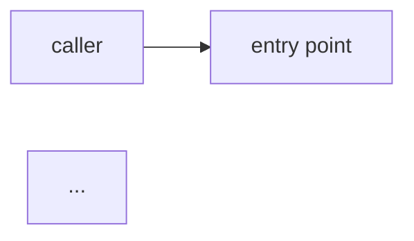

The user wants to create or promote a walkthrough. Slug: $ARGUMENTS

Walkthroughs are the most reader-friendly layer — narrative explainers
with Mermaid diagrams, ≥2000 words, citing real code. They graduate
from `learn/drafts/<slug>.md` (essay outlines) to
`learn/walkthroughs/<slug>.md` (ready-to-link essays) or are written
fresh when the user asks for one directly.

Steps:

1. Validate slug.

2. Check for an existing draft at
   `${CARTOGRAPH_ROOT:-$CLAUDE_PROJECT_DIR}/learn/drafts/<slug>.md`. If present, read it —
   the walkthrough is the polished, expanded form.

3. Path: `${CARTOGRAPH_ROOT:-$CLAUDE_PROJECT_DIR}/learn/walkthroughs/<slug>.md`. If exists,
   STOP and ask the user whether to overwrite or edit in place.

4. Today's date:
   !`date +%Y-%m-%d`

5. Scaffold:

```markdown
---
layer: walkthrough
slug: <slug>
last_revised: <today>
reviewed_by_human:
distilled_from:
  - learn/drafts/<slug>.md   # if a draft fed this
---

# <Title>

## What you'll learn

(Bullet list — the specific takeaways. Be specific, not aspirational.)

## Mental model first

(One Mermaid diagram showing the shape of the system you're walking
through. Required by content lint.)



## Step 1 — <heading>

(Code snippet + commentary. Cite real lines via `path/to/file.py:NNN`.)

## Step 2 — ...

(continue)

## What this skips

(Honest limitations — what an engineer reading this still won't know.)

## Where to go next

(Links into bedrock, topic notes, papers, or research.)
```

6. Fill in from the draft (if any) or the session's exploration. Lint
   floor: ≥2000 words, ≥1 Mermaid diagram, ≥5 code citations.

7. If a draft fed this, mark its frontmatter:
   `distilled_into: learn/walkthroughs/<slug>.md`
   and `status: promoted` so it won't be picked again.
