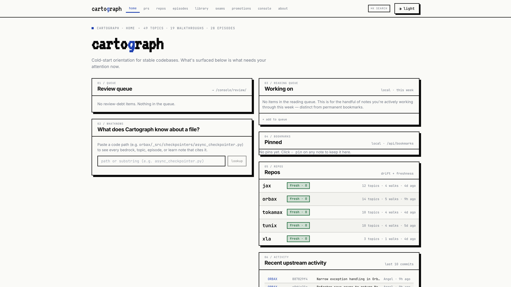
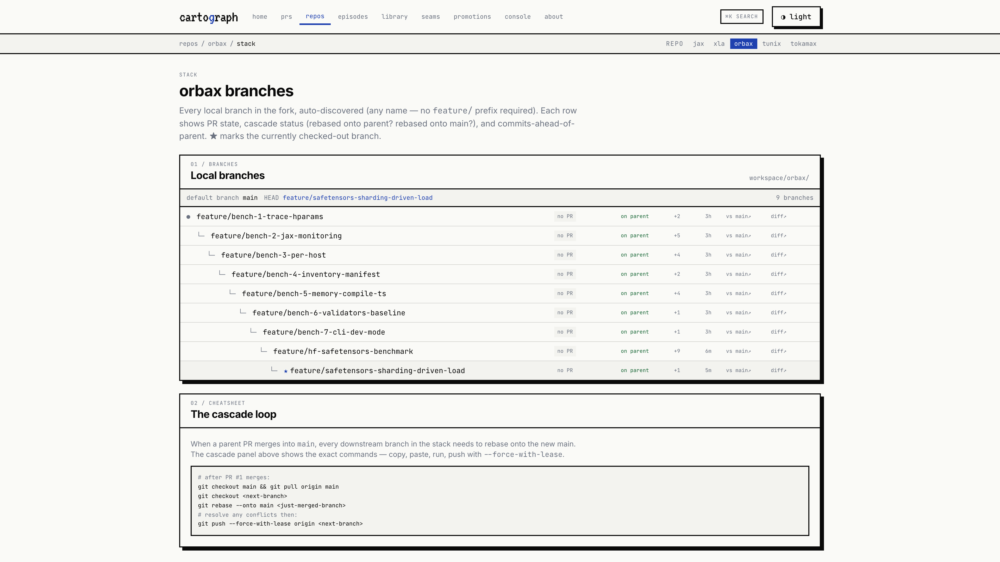
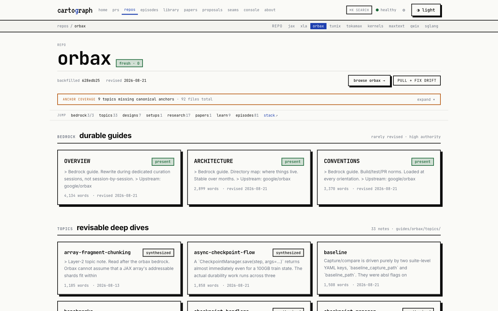
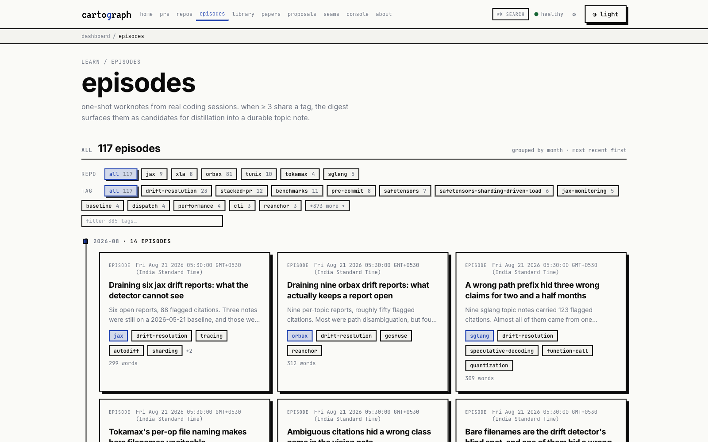
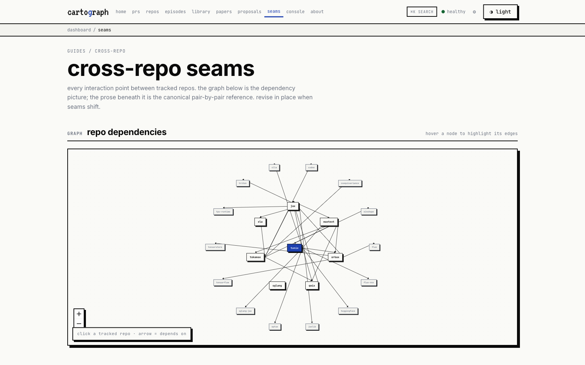
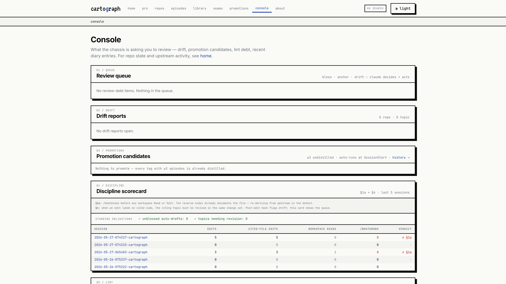
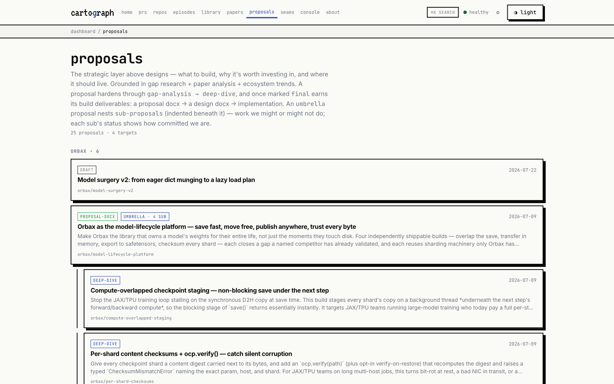
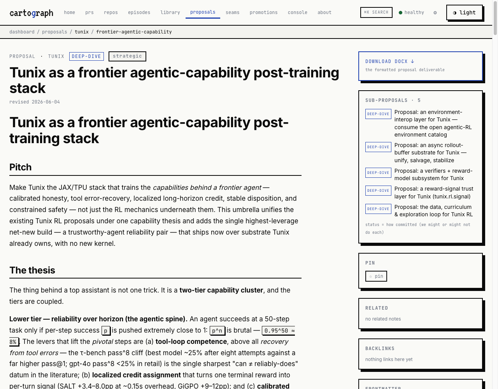

# cartograph

> Built by [Mridul Sahu](https://github.com/mridul-sahu).
> Status: **v0** — battle-tested in one developer's daily workflow, opened up
> because the loop is good. Expect rough edges around first-time setup;
> file issues at <https://github.com/mridul-sahu/cartograph/issues>.

**An external memory for Claude Code.** Cartograph is a layered notebook that
sits next to your codebase and carries your understanding *forward* between
sessions — so the model doesn't re-derive how your code works every single
time you open it.



```
┌─────────────────────────────────────────────────────────────────────────┐
│  every prompt you send →                                                 │
│    cartograph injects bedrock + topic notes + episodes + research        │
│    that match what you're working on,                                    │
│  every session you finish →                                              │
│    cartograph captures what was learned, drafts an episode,              │
│    flags topics whose code has drifted past them,                        │
│  every three episodes sharing a tag →                                    │
│    cartograph asks you to promote them into a topic note,                │
│  every blessed topic →                                                   │
│    folds back into bedrock during curation passes.                       │
└─────────────────────────────────────────────────────────────────────────┘
```

The notebook gets *better* the more you use it. The model gets *faster*
because it's not re-deriving the same five files for the seventeenth time
to remember what you already know.

---

## The problem cartograph solves

LLM coding sessions are stateless. Every session that touches a non-trivial
codebase starts from zero:

- Re-read the same files to remember how the subsystem fits together.
- Re-discover the same gotchas you debugged three weeks ago.
- Re-explain the same design decisions to the model.
- Re-derive that "oh right, this function's only called from one place but
  the type signature lies about it" insight that took half an hour last time.

Existing answers don't compound:

| Approach | Why it falls short |
|---|---|
| `CLAUDE.md` | Works for repo-wide conventions, but rots into a wall of text. One file fits all turns badly. |
| Custom prompts | Inject the same blob every turn regardless of what you're working on. |
| Embedding search | Retrieves chunks but loses structure; can't tell a 6-month-old session log from a load-bearing topic note. |
| Per-session notes | Pile up; nobody reads back; you re-derive anyway. |

Cartograph fixes the underlying problem: **understanding is a first-class
artefact**. Written down once, surfaced automatically when relevant, revised
in place when the code drifts past it.

### Where cartograph sits vs adjacent tools

| Tool | What it does | What cartograph adds |
|---|---|---|
| **`CLAUDE.md`** alone | One static file per repo with conventions and a discipline reminder | Per-turn context selection (top-3 topics + episodes + research by prompt overlap), per-file reverse index, drift detection against upstream, the auto-promotion loop |
| **Aider** / **Continue** / **Cursor** memory | In-app "memories" or "rules" — flat, often per-chat, no structure across sessions | Layered structure (bedrock → topics → episodes), automated promotion from chats to durable notes, citation-anchored drift reports, a separate UI for browsing/curating |
| **Embedding search** over a codebase (Sourcegraph Cody, llamaindex, etc.) | Retrieves chunks by semantic similarity | Hand-curated notes ranked above raw chunks; understanding that compounds across sessions instead of resetting each query; per-file index that maps code paths to the notes citing them |
| **Project wiki** / **Notion** / **Obsidian** | A place to write notes | The notes are auto-injected by hooks at every prompt; freshness is tracked against upstream commits; promotion + revision are mechanized via slash commands and `claude -p` |
| **`pre-commit`** / **`husky`** | Per-commit hooks | A parallel layer: per-session, per-prompt, per-edit hooks that capture *what was learned*, not just *what was changed* |

Cartograph is **not** a replacement for any of these — it sits underneath
your AI coding tool of choice and feeds it better context. The tight
integration is specifically with **Claude Code's hook + slash + MCP
system**; other agents would need their own integration layer.

---

## The philosophy

Three commitments shape every piece of the design.

**1. Carry forward, don't re-derive.** Cartograph is your *first* layer of
investigation, not your last. Before reading upstream code, you ask: "what
does cartograph already know?" If it knows something, you use it. If it's
wrong, you fix it. Re-deriving is a defect.

**2. Better, not just bigger.** Drift is the enemy. A topic note that
contradicts the code it cites is worse than no note. The Stop hook, the
drift reports, the revision discipline — all of it exists to make cartograph
*more accurate* with each session, not just *larger*.

**3. The notebook is the product.** Cartograph isn't a search index over
your sessions. It's a curated, layered, hand-shaped corpus that you actively
maintain. The framework just removes the friction.

---

## How it works (the architecture)

### Six content layers

Ordered from "carefully shaped" to "loose drafts":

| Layer | Path | What it holds | Lifecycle |
|---|---|---|---|
| **Bedrock** | `guides/<repo>/{overview,architecture,conventions}.md` | The canonical "what this codebase is" doc for each tracked repo | Hand-curated. Rebuilt headlessly via `just backfill <repo>` when upstream drifts |
| **Topic notes** | `guides/<repo>/topics/<tag>.md` | Distilled understanding of a subsystem, gotcha, or pattern | Promoted from ≥3 same-tag episodes. Revised in place when code disagrees |
| **Episodes** | `episodes/YYYY-MM/*.md` | Per-session worknotes: task, files touched, insight | Auto-drafted by the Stop hook. Reviewed via the inbox |
| **Research / Papers** | `research/<repo>/*.md`, `papers/<repo>/<slug>/notes.md` | External material — blog posts, RFCs, papers, comparisons | Manual via `/research` / `/paper`; auto-drafted when a session used WebFetch / WebSearch |
| **Seams** | `guides/seams.md` | Cross-repo edges ("JAX lowers via XLA's `lower_jaxpr_to_module`") | Appended via `/seam` |
| **Proposals** | `proposals/<repo>/<slug>.md` | Investment-cased build plans — what to build next, grounded in gap research + papers + ecosystem trends | A phased lifecycle (`gap-analysis → deep-dive → final → proposal-docx → design → implement`); nest as an **umbrella + sub-proposals**; formalized into a `.docx` via `/proposal-final-draft` |

Plus a `learn/` tree for **walkthroughs**, **ramp-ups**, and **drafts** —
narrative content for explaining a codebase to someone new, and a
`designs/` tree for formal design docs with d2 diagrams and rendered docx.

### Eight Claude Code hooks (the chassis)

Cartograph wires into Claude Code's hook system to make the loop automatic.
You don't think about it; it just runs.

| Hook event | Hooks fired | What happens |
|---|---|---|
| **SessionStart** | `session-log.sh start` · `upstream-sync.sh` · `digest.sh` · `auto-promote.sh` · `build-file-index.py` · `build-search-index.py` · `anchor-coverage.py` · `diary.sh --if-stale` | Opens a session log. Fetches upstream and writes drift reports. Surfaces promotion candidates. **Auto-promotes ≥3 same-tag episodes into a topic note via `claude -p`.** Rebuilds the file reverse-index and BM25 search index. Audits anchor coverage. Writes today's diary entry. |
| **UserPromptSubmit** | `inject-context.sh` | Detects scope from `cwd`; injects bedrock + seams + top-3 topics + top-3 episodes + top-3 research notes ranked by keyword overlap + BM25 rerank. **Claude sees this before every turn.** |
| **PreToolUse** (Read / Edit) | `pre-read-augment.sh` · `pre-edit-augment.sh` | Before any `Read`, injects every cartograph note citing that file path. Before any `Edit` of a topic note, fetches its drift report. |
| **PostToolUse** (Edit / Write) | `token-check.sh` · `session-log.sh touch` · `post-edit-topic-mark.sh` · `normalize-note-frontmatter.sh` | Scans new content for forbidden identity tokens. Marks edited topics for re-review. Backfills missing frontmatter fields. |
| **Stop** | `episode-prompt.sh` · `usage-audit.sh` · `session-log.sh stop` | Reminds Claude to write an episode if anything was learned. **Auto-drafts an episode in the background via `claude -p`** if ≥3 edits happened with no episode written. Same for research/paper notes if the session used WebFetch / WebSearch. |

The result: orientation injects context, you do the work, hooks capture
what happened, slash commands let you author or revise, the local UI lets
you browse. **Nothing rots quietly** — drift surfaces, episodes promote,
topics revise.

### Three MCP tools (mid-conversation reach)

If you opt in via `.mcp.json`, the cartograph MCP server exposes three
tools Claude can call mid-turn — not via slash command, just as part of
the model's normal reasoning. Each is deliberately read-only; writes
still go through the slash commands.

**`cartograph_search(query, repo?, layer?, k=10)`** — BM25 retrieval
across every layer. Call before grepping.

```jsonc
// call:    cartograph_search(query="async checkpoint coordination", repo="orbax", k=5)
// returns:
{
  "query": "async checkpoint coordination",
  "hits": [
    {
      "path": "guides/orbax/topics/async-checkpoint-flow.md",
      "title": "Async checkpoint flow",
      "layer": "topic",
      "repo": "orbax",
      "score": 9.87
    },
    {
      "path": "episodes/2026-04/2026-04-15-checkpoint-handoff.md",
      "title": "Coordinator handoff edge case",
      "layer": "episode",
      "repo": "orbax",
      "score": 6.32
    },
    {
      "path": "research/orbax/distributed-save-vs-tf-saver.md",
      "title": "Distributed save vs tf.train.Saver",
      "layer": "research",
      "repo": "orbax",
      "score": 4.18
    }
  ],
  "generated_at": "2026-05-27T18:00:00Z"
}
```

**`cartograph_notes_for_file(path)`** — reverse index. Call before
`Read` of any workspace file. The `PreToolUse:Read` hook already fires
this automatically; call it explicitly when you're *choosing* which file
to open next.

```jsonc
// call:    cartograph_notes_for_file(path="checkpointers/pytree_checkpoint.py")
// returns:
{
  "hits": [
    {
      "path": "orbax/_src/checkpointers/pytree_checkpoint.py",
      "entries": [
        {
          "note": "guides/orbax/topics/pytree-restore.md",
          "layer": "topic",
          "anchors": [42, 78, 156],
          "sources": ["bedrock", "topic"]
        },
        {
          "note": "episodes/2026-03/2026-03-20-pytree-edge-case.md",
          "layer": "episode",
          "anchors": [78]
        }
      ]
    }
  ],
  "total": 1,
  "generated_at": "2026-05-27T18:00:00Z"
}
```

**`cartograph_drift(repo, anchor?)`** — drift state. Call before
trusting any topic note that might be stale, before extending a topic,
or before recommending code that touches a cited line.

```jsonc
// call:    cartograph_drift(repo="orbax")
// returns:
{
  "repo": "orbax",
  "repo_report": "# orbax drift report\n\nbedrock backfilled_from_sha=887829f4; upstream=a1b2c3d4 (37 commits ahead)\n\n## changed files cited in bedrock\n- checkpointers/pytree_checkpoint.py (12 commits)\n- ...",
  "open_topic_drifts": [
    ".drift-reports/topics/orbax/pytree-restore.md",
    ".drift-reports/topics/orbax/async-checkpoint-flow.md"
  ]
}

// call:    cartograph_drift(repo="orbax", anchor="checkpointers/pytree_checkpoint.py:78")
// returns: (same as above, plus:)
{
  // ...
  "anchor": "checkpointers/pytree_checkpoint.py:78",
  "topics_citing_anchor": [
    ".drift-reports/topics/orbax/pytree-restore.md"
  ]
}
```

---

## Features

### 1. Orientation injection (what gives every turn its context)

The `UserPromptSubmit` hook detects your scope, then injects:

- **All bedrock** for the current repo (full text — it's the floor).
- **All cross-repo seams** (full text — usually a single page).
- **Topic notes as a lean menu**: the single best match in full, plus a
  menu of the next 7 (title + summary + path) the agent pulls with `Read`.
- **Episodes** (non-superseded, non-distilled, repo-scoped): same shape.
- **Research notes**: menu only (surfaced so you UPDATE existing notes
  instead of starting duplicates).
- A **revision reminder** ("if a topic note contradicts the code you read,
  fix it in place").

Ranking is IDF-weighted keyword overlap (rare discriminative terms beat
corpus-common ones) with a usage feedback signal: notes the agent actually
followed in past sessions rank higher; notes injected five times and never
used take a penalty. All layers dedup against each other, then a BM25
rerank pass via `scripts/build-search-index.py` catches semantic matches
keyword overlap misses ("checkpoint hangs" → `async-checkpoint-flow.md`).
The tokenizer splits identifiers, so `AsyncCheckpointer` matches a query
for "checkpointer".

You can re-inject mid-session with `/orient`, see what would be injected
with `/queue`, expand the search with `/find <natural query>`, restore the
legacy full-bodies shape with `CARTOGRAPH_INJECT_MODE=full`, or disable
injection entirely with `CARTOGRAPH_INJECT_DISABLE=1` (that switch exists
for the eval harness — see feature 12).

### 2. The compounding loop (episodes → topics → bedrock)

Episodes are cheap: write one whenever a session produces a durable
insight. The Stop hook reminds you; if you skip, an auto-draft fires in
the background via `claude -p`.

```
You write 3+ episodes tagged `pjit-axes` over a few weeks.
   ↓ next SessionStart
auto-promote.sh sees 3 same-tag episodes not yet distilled.
   ↓ claude -p drafts a topic note
guides/jax/topics/pjit-axes.md is created with distilled_from: [...].
   ↓ you review, edit, set reviewed_by_human: 2026-05-27
   ↓ next curation pass
fold-topic-to-bedrock.sh folds the topic into architecture.md
   in the appropriate section.
```

The auto-drafted output has `auto_drafted: true` and shows up in
`/queue` and the inbox UI. **Default-approve semantics:** anything not
explicitly `rejected: true` is eligible for further promotion. You opt
out, not in.

### 3. Drift detection + auto-revision

Every bedrock file records `backfilled_from_sha:` — the upstream sha it
was written against. SessionStart fetches upstream; `drift-check.sh`
compares the recorded sha to the current tip; if upstream moved,
`.drift-reports/<repo>.md` is written and the orientation hook surfaces
it every turn until the drift is closed.

Topic-note drift is finer-grained: `topic-drift.sh` checks each cited
file individually. `/revise <topic>` reads the per-citation drift report
and pre-stages `git log -p` for each changed citation — you edit with
the diff already in front of you.

Two ways to close drift:

- **Manually:** `/revise <topic>`; bump `last_revised:`; write a small
  episode.
- **Autonomously:** `/auto-revise <topic>` invokes `claude -p` headlessly
  to revise the topic in place, citing the new code. You review the diff
  and accept or revert.

### 4. Bedrock backfill (headless rebuilds)

```bash
just backfill <repo>
```

Invokes Claude Code headlessly with the bedrock quality contract
(`docs/quality-bar.md` — required headings, word-count floors, file:line
citation density, forbidden tokens) and rewrites all three bedrock files
against the current upstream tip. Takes 20–60 minutes for a non-trivial
repo; runs in the background. Progress visible at
`http://localhost:47777/repo/<repo>/` or by tailing
`.backfill-log/*-<repo>.log`.

For repos > 500K LOC (XLA-scale), the prompt uses a subsystem-first
approach: cover 1–2 subsystems per session rather than the whole tree.



### 5. Stacked-PR workflow

For repos where you maintain multiple in-flight PRs in dependency order,
six slash commands wrap [git-spice](https://abhinav.github.io/git-spice/)
(`gs`) so the cascade-rebase math doesn't bite you:

| Slash | Use when |
|---|---|
| `/stack` | "Where am I in the stack?" — shows the tree |
| `/stack-new <slug>` | Start a new branch on top of HEAD (parent recorded automatically) |
| `/stack-pr` | Push current branch + open/update its PR |
| `/stack-submit` | Push every branch + open/update each PR |
| `/stack-restack` | After amending or after a parent gained commits, cascade-rebase descendants |
| `/stack-sync` | After PRs merged: pull main, drop merged branches, cascade-rebase the rest |

All use `--force-with-lease`, never raw `--force`. The local UI's
`/repo/<r>/stack/` page auto-discovers every branch in the fork (no
`feature/` prefix required), shows PR state, cascade hints, "diff vs
main" / "diff vs parent" GitHub compare links, and a "run cascade"
button that fires `gs upstack restack` from the current HEAD.

### 6. The local UI (37 surfaces on `:47777`)

A static-built Astro + React site backed by a FastAPI server. Designed
for the human-shaped views — what slash commands don't cover.

- **Home** — recent activity, pinned notes, drift summary, review queue
- **Repos** — per-fork deep dive: bedrock, topics, stack, drift report,
  PR list, most-cited files
- **Library** — designs, papers, research, walkthroughs, drafts,
  ramp-ups, all browsable
- **Episodes** — timeline view with filters
- **Seams** — interactive graph of cross-repo edges (React Flow)
- **Console** — the review queue: every auto-drafted note awaiting a
  human thumbs-up
- **Console / Inbox** — auto-detected promotion candidates, drift
  reports needing attention, in-flight leases
- **Diary** — daily entries (auto-written when stale)
- **PRs** — every PR you've opened across every tracked upstream, with
  state, mergeable, review decision, age
- **Per-repo stack** — branches, PR state, cascade status, GitHub
  compare links, one-click cascade rebase

**⌘K opens a global command palette** — BM25 search across everything
plus navigation commands.









### 7. VS Code / code-server extension

A bundled extension (`extensions/cartograph/`) surfaces cartograph
inside the editor:

- **Gutter markers** on every line a bedrock / topic note / seam cites
- **Hover cards** with the note's discussion of the line
- **Status-bar banner** — how well-charted the open file is
- **Walkthrough tours** — step through a walkthrough; the editor jumps
  to each cited `file:line`, across repos
- **Ask Claude** (⌘⇧A) — explain a selection with bedrock + topic notes
  as context
- **Cross-repo seams navigation** — click an edge, jump to the other
  repo
- A **Cartograph** activity-bar panel with live insights for the active
  file

Activates only inside a tracked fork. Build + install with `bash
scripts/build-extension.sh`.

### 8. Identity firewall (publishable PRs by default)

When you work inside `workspace/<repo>/`, you're operating on a public
fork — your commits, branches, and PRs will be visible to the upstream
project. Cartograph enforces a content firewall so the tooling that
brought you there is invisible to the upstream:

- **`commit-msg` hook** (per fork) — rejects commits whose messages
  contain framework-internal tokens (`cartograph`, `anthropic`,
  `claude code/opus/sonnet/haiku`) or anything in
  `CARTOGRAPH_FORBIDDEN_EXTRAS`. Strips `Co-Authored-By: Claude` /
  Anthropic / Cartograph trailers automatically.
- **`pre-push` hook** (per fork) — refuses pushes via the wrong SSH
  host alias, and refuses branches with forbidden tokens.
- **`PostToolUse` token-check** — soft warning earlier in the loop, on
  every `Edit` / `Write`.
- **`scripts/lint-content.sh`** — same regex on bedrock / topic / episode
  content, surfaced via `/lint`.

You can configure your own personal tokens (company name, internal
codenames) via `CARTOGRAPH_FORBIDDEN_EXTRAS` in `cartograph.env`.

### 9. The research → build pipeline (gap-scan → propose → trees → docx)

Cartograph isn't only a notebook for *understanding* code — it's a pipeline for
deciding **what to build next** and turning that into a formal, reviewable
proposal, each step grounded in the layers above. Four slash commands form the
chain:

- **`/gap-scan <repo> <slug> <question>`** — survey an external ecosystem (e.g.
  "what do PyTorch post-training frameworks have that JAX should build?"),
  adversarially verify the findings, ground them against the repo's own topic
  notes, and emit a **prioritized build backlog**.
- **`/analyze-paper <repo> <slug> <url>`** — deep-read a paper end to end and
  land an *implementable-concept* topic note for a target library.
- **`/propose <repo|new> <slug> <theme>`** — turn gaps + papers + ecosystem
  trends into an **investment-cased proposal** with a falsifiable thesis and a
  repo-home decision (it can even propose a brand-new repo).
- **`/proposal-final-draft <repo> <slug>`** — render a proposal into a formal,
  well-researched **`.docx`** in a fixed structure (Introduction · Background ·
  Ecosystem + Impact · High-Level Design with `d2` diagrams · Feasibility & Risk
  · References), validated and ready to share.

Proposals move through an explicit **lifecycle** — `gap-analysis → deep-dive →
final → proposal-docx → design-docx → implementing` — and form a **tree**: an
*umbrella* proposal (a north-star like "Tunix as a frontier agentic-capability
stack") nests **sub-proposals** you might or might not do, each carrying its own
status badge so the tree shows commitment at a glance.



Each proposal page surfaces its lifecycle next-action (a copy-to-clipboard slash
command), its parent and sub-proposals, and a one-click **download** of the
formal docx once it's built.



### 10. Thirty-three slash commands

| Category | Commands |
|---|---|
| **Orientation** | `/whatknows <path>` — reverse index for a file • `/cite <symbol>` — grep across layers • `/find <natural query>` — BM25 retrieval • `/queue` — review queue • `/orient` — re-inject for current cwd • `/freshness` — per-fork upstream age • `/metrics` — bedrock freshness, review ratio, drift count |
| **Authoring** | `/episode <title>` • `/research <repo> <slug>` • `/paper <repo> <slug>` • `/topic <repo> <slug>` • `/draft <slug>` • `/walkthrough <slug>` • `/seam <a> <b>` • `/pin <path>` |
| **Curation** | `/revise <topic>` — with diff pre-staged • `/promote <tag>` — episodes → topic • `/auto-revise <topic>` — headless drift fix • `/backfill <repo>` — full bedrock rebuild |
| **Research → proposals** | `/gap-scan <repo> <slug> <q>` — ecosystem gap analysis → backlog • `/analyze-paper <repo> <slug> <url>` — paper → implementable note • `/propose <repo\|new> <slug> <theme>` — investment-cased proposal • `/proposal-final-draft <repo> <slug>` — formal proposal docx |
| **Stacked PRs** | `/stack` • `/stack-new` • `/stack-pr` • `/stack-submit` • `/stack-restack` • `/stack-sync` |
| **Hygiene** | `/doctor` — verify all forks • `/lint` — content quality bar |

### 11. Eighty-two API endpoints

Everything the slash commands and UI do is exposed as a JSON API on
`http://localhost:47777/api/`. Useful if you want to build your own
surfaces — Raycast extension, mobile dashboard, Slack bot, whatever.
A few highlights:

- `GET /api/stack/{repo}` — full stack tree with PR state + cascade hints
- `GET /api/prs` — aggregate PRs across every tracked upstream
- `GET /api/find?q=<query>` — BM25 search across all layers
- `GET /api/repo/{repo}/most-cited` — files ranked by citation count
  across bedrock + topics + episodes
- `GET /api/drift/{repo}` — current drift state
- `POST /api/backfill/{repo}` — kick off a headless backfill
- `POST /api/auto-revise/{repo}` — kick off headless drift-fix for one
  topic; `/all` for everything drifted
- `POST /api/promote/{tag}` — promote ≥3 same-tag episodes to a topic
- `GET /api/queue` — the review queue (auto-drafted, drifted, in-flight)
- `GET /api/errors` — the chassis error feed (tail of `errors.log`)
- `GET /api/injection-cost` — per-repo bedrock token estimates + budget warns
- `POST /api/topic/{repo}/{slug}/touch` — bump `last_revised` on a stale topic
- `POST /api/backfill/all` — sequential all-repo backfill with status polling

### 12. Self-measurement (eval harness, usage feedback, error feed)

A knowledge system that only accumulates is a filing cabinet. Three
mechanisms keep cartograph honest:

- **Golden-question eval harness** (`scripts/eval/run-eval.sh`): a set of
  graded architecture questions per repo, each run headlessly twice —
  orientation on vs `CARTOGRAPH_INJECT_DISABLE=1` (which disables every
  injection surface: prompt-time, pre-Read, pre-Edit). The per-arm deltas
  in score / turns / wall time are the regression gate for every retrieval
  change. Refusal-shaped results (usage limits, overloads) are detected,
  flagged, and excluded from summaries. Results time-series under
  `.cartograph/eval/`. Run evals on a quiet machine — concurrent agent
  load degrades sessions silently. Note the off arm can still *pull* the
  notebook via `Read`, so the comparison measures push vs pull retrieval,
  not notebook vs nothing.
- **Usage feedback loop**: every injected note is recorded; a follow-up
  `Read` of the note (or a file it cites) marks it *used*, which boosts its
  future ranking. Notes injected repeatedly and never used sink. Per-session
  records land in `usage-log.jsonl`.
- **Central error feed**: chassis failures (publish push, curation drains,
  enqueues) append to `.cartograph/errors.log` and surface on the console.
  Curation drains account per task — failed tasks stay queued and retry
  instead of vanishing with their batch.

Operationally, `scripts/setup-launchd.sh` (macOS) puts the server under
KeepAlive supervision and schedules a nightly maintenance pass — drift
auto-revision, content lint, anchor-gap fixes, curation drain, session
archival — so the compounding runs while you sleep.

---

## Setup

Prerequisites: `git`, `gh` (GitHub CLI, authenticated), `just`, `node` 18+,
`python3` 3.11+, `claude` CLI.

```bash
# Clone
git clone git@github.com:<your-github-user>/cartograph.git
cd cartograph

# Configure identity
cp cartograph.env.example cartograph.env
$EDITOR cartograph.env       # fill in CARTOGRAPH_GITHUB_USER, _GIT_USER_EMAIL, etc.

# Install dependencies
just deps                     # npm install + pip install fastapi, uvicorn, pyyaml

# Verify
just doctor                   # warns if gh auth doesn't match your config

# Start the UI
just serve                    # FastAPI + pre-built web on http://localhost:47777
# OR
just dev                      # Astro dev (4321) + FastAPI with reload (47777) + code-server
```

### Add your first tracked repo

```bash
just add-repo <upstream-org>/<repo>
```

This:

1. Forks `<upstream-org>/<repo>` to your GitHub account via `gh repo fork`.
2. Clones into `workspace/<repo>/`.
3. Configures `user.name`, `user.email`, `core.sshCommand` from `cartograph.env`.
4. Adds the `upstream` remote.
5. Installs the per-fork `commit-msg` and `pre-push` hooks (with your
   forbidden-token regex baked in).
6. Drops a per-fork `CLAUDE.md` into `.git/info/exclude` (never
   committed; gives Claude the identity rule when working in that fork).
7. Kicks off a headless bedrock backfill via `claude -p` in the
   background.

The bedrock build takes 20–60 minutes. Watch progress at
`http://localhost:47777/repo/<repo>/` or tail the log under
`.backfill-log/`.

### Open a Claude Code session

Once bedrock exists, open Claude Code anywhere under `workspace/<repo>/`.
The orientation hook fires on every prompt; cartograph starts injecting
context.

For a walkthrough of the first three sessions — from this point through
your first episode and your first promoted topic note — see
[`docs/getting-started.md`](docs/getting-started.md).

---

## Regular usage

**During a session.** You're working in a fork. Every prompt gets bedrock
+ relevant topics + relevant episodes injected. You work. If you spot a
topic note that contradicts the code you just read, you fix it in place
— no permission asked. If you discover something durable, you write an
episode at session end (`/episode <title>`) or let the Stop hook
auto-draft one.

**Between sessions.** Episodes accumulate. The SessionStart hook
surfaces promotion candidates ("3 episodes tagged `pjit-axes` aren't yet
distilled; run `/promote pjit-axes`"). You promote — Claude drafts a
topic from the episodes; you review at `/console/review/`. Topic notes
that get blessed (`reviewed_by_human:` set) feed into future bedrock
folds.

**When upstream moves.** The drift checker writes a report under
`.drift-reports/<repo>.md` when the bedrock's sha falls behind. You
either confirm the diff is additive (bump the sha) or run
`just backfill <repo>` to rebuild. Per-topic drift reports flag
individual citations that have changed — `/revise <topic>` pre-stages
the diff so the revision is mechanical.

**Browsing.** The local UI at `:47777` is for the human-shaped views.
⌘K searches across everything. The console shows what's in the queue.
The repo pages show stack state, PRs, drift, most-cited files.

**Inside the editor.** The VS Code extension (in `extensions/cartograph/`)
lets you see citation gutter markers and step through walkthroughs
without leaving the file.

---

## Configuration

All identity and per-user behavior comes from `cartograph.env`
(gitignored). The committed `cartograph.env.example` documents every
key. Quick reference:

| Key | Purpose |
|---|---|
| `CARTOGRAPH_GITHUB_USER` | GitHub account for fork creation + PR queries |
| `CARTOGRAPH_GIT_USER_NAME` | `git config user.name` written into per-fork `.git/config` |
| `CARTOGRAPH_GIT_USER_EMAIL` | `git config user.email`; the `commit-msg` hook enforces this |
| `CARTOGRAPH_SSH_HOST_ALIAS` | `git@<alias>:owner/repo.git`; default `github.com`. Use a custom alias if you keep a dedicated key for this account |
| `CARTOGRAPH_SSH_COMMAND` | Optional explicit `core.sshCommand` per fork (pins a key) |
| `CARTOGRAPH_FORBIDDEN_EXTRAS` | Comma-separated extra tokens scrubbed in bedrock + commits + PRs (company name, internal codenames, etc.) |

---

## Docs

- [`docs/getting-started.md`](docs/getting-started.md) — walkthrough of
  the first three sessions, from fresh clone to a working compounding loop
- [`docs/extending.md`](docs/extending.md) — contributor-shaped docs: how
  to add a slash command, a hook handler, an MCP tool, or a content layer
- [`CLAUDE.md`](CLAUDE.md) — the operator protocol Claude reads at the
  start of every session
- [`docs/integration.md`](docs/integration.md) — the full hook flow with
  timing and forbidden-token enforcement
- [`docs/quality-bar.md`](docs/quality-bar.md) — bedrock quality contract
  (required headings, word floors, citation density)
- [`design-system/MASTER.md`](design-system/MASTER.md) — brand + UI tokens
- [`extensions/cartograph/README.md`](extensions/cartograph/README.md) —
  VS Code / code-server extension
- [`CHANGELOG.md`](CHANGELOG.md) — release-by-release summary of user-visible
  changes

---

## Author

Cartograph is built and maintained by
[Mridul Sahu](https://github.com/mridul-sahu).
Bug reports and PRs welcome at
<https://github.com/mridul-sahu/cartograph>.

## License

MIT — see [LICENSE](LICENSE). Copyright (c) 2026 Mridul Sahu.
